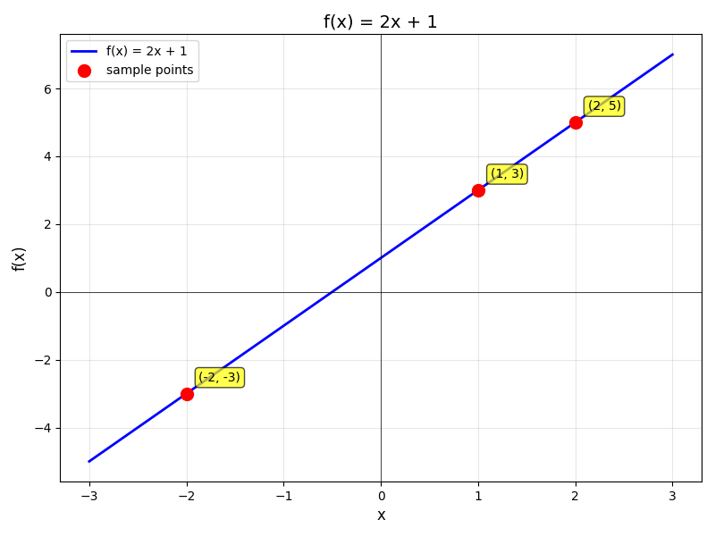
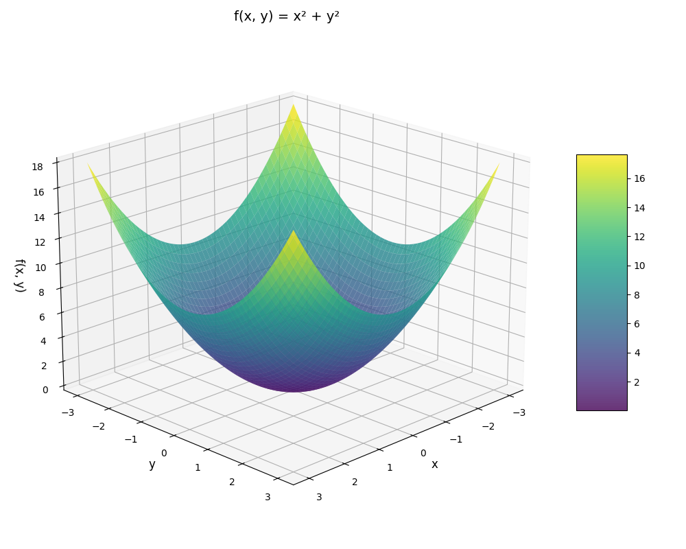
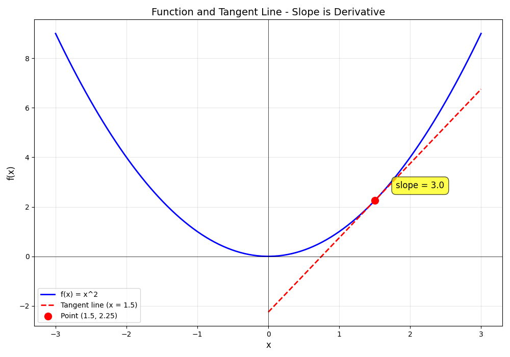
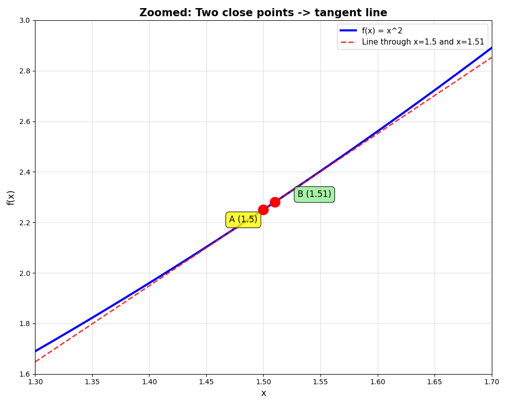

<!--
title:   独習メモ 機械学習 数学入門 〜基礎数学〜
tags:    機械学習,独学,AI,メモ
id:      d92d0728fc17b79a7c1c
private: true
-->

:::note alert
**注意事項**
本記事は学習目的のメモ書きです。数学的な厳密性よりも概念的な理解を優先した内容となっております。
最終的な目標は機械学習とは何かを把握することにあり、正確性を保証するものではありません。
正確な情報を必要とされる場合は、信頼性の高い他の資料をご参照ください。
:::

# 目次

データサイエンスのための数学入門
1. 数学入門 〜基礎数学〜
1. 数学入門 〜確率〜（予定）
1. 数学入門 〜記述統計と推測統計〜（予定）
1. 数学入門 〜線形代数〜（予定）
1. 数学入門 〜線形回帰〜（予定）
1. 数学入門 〜ロジスティック回帰〜（予定）

# はじめに

機械学習・データサイエンス関連の **書籍を読み進めるため** の数学の知識を身につけます。
ですので、深くまで理解しようとしない数学へ入門します。

## 数論

|項目|説明|例|
|--|--|--|
|自然数|1,2,3,4,5..と続く数のこと。正の数のみ|1,2,3|
|0を含む自然数・非負数|自然数に0の概念を足したもの|10, 1000, 1090|
|整数|正と負の自然数および0|-10, -2, 0, 1, 10|
|有理数|2/3のように分数で表せるすべての数|2/3, 6.87(=687/100), 2(=2/1)|
|無理数|分数で表現できない数 πや√2やオイラー数など|3.141592.....と無限に続くもの|
|実数|有理数と無理数を含めたもの|2/3, π, √2|

データサイエンスではほとんどの場合、自然数・整数・実数を扱う。

## 関数

入力 => 出力に変換するための変換器です。

### 引数が1つの関数

たとえば、`f(x)=2x+1`という関数があったとすると。

|x|出力|
|--|--|
|1|3|
|2|5|
|-2|-3|

このような入力と出力の関係は直交平面グラフで表現することもできる。



### 引数が2つの関数

xとyと引数が2つある、`f(x,y)=x^2+y^2`という関数があったとすると、
2次元のグラフでは表せなくなり、3次元のグラフとなる。



なお、4次元以上のグラフとなると図で表現できない関数となる。

### (コラム)関数と大規模言語モデル

実はChatGPTも関数と言うことができる。
乱暴に言えば、チャットの文章という入力を与えて、返信という出力を返す関数。

GPTのモデルを学習させるということは、
関数の内部にある数億〜数十億個のパラメータ(重み)を調整して、
入力に対する出力の対応関係を最適化する作業でもある。

## 総和

シグマ記号Σ で表される要素を合計するものを総和と呼ぶ。
数式アレルギー持ちの人は難しく感じるかもしれないがこれがやることは簡単です。
ニューラルネットワーク関連書籍の理解においては、実際に手動で計算できる必要はありませんが、このシグマ記号ができたときにどのようなことを行なっているかが理解できればOKです。

$$
\sum_{i=1}^{5} 2i
$$

1から5までの各数に2を掛けて、合計するだけです。

```
1*2 + 2*2 + 3*2 + 4*2 + 5*2 = 30
```

## 対数

「2を何乗すれば8になるか？」というのが対数です。
この例であればxに3が入ることは簡単にわかる。

$$
2^x = 8
$$

この関係を別の方法で表したものが、log関数といいます。

$$
\log_2 8 = x
$$

### (コラム)なぜ対数を使うのか？

対数には計算をシンプルにしつつ、計算結果を保つという便利な法則があります。

掛け算が足し算になる法則。
$$
\log(A \times B) = \log A + \log B
$$
他にも、割り算が引き算、べき乗が掛け算になる法則などがあります。

これはDeepLearningの計算で役に立ちます。

DeepLearningにはこんな計算がたくさん出てきます。

```
P(文章) = 0.01 × 0.3 × 0.02 × 0.05 × 0.1 × ... (何千回も続く)
```

これがどのような問題になるかというと、少数の連続した掛け算が何千回も続くと
コンピュータが表現できる数の限界を超えて0に丸められてしまい（アンダーフロー）正しい計算結果が得られないという課題が発生します。

対数を利用して式を変換することで掛け算を足し算に変換することができます

```
log P(文章) = log(0.01) + log(0.3) + log(0.02) + ... 
            = -2 + (-0.52) + (-1.7) + ...
```

実際にはDeep Learningでは2つの計算結果の大小を比較するということを何度も繰り返し行います。
その際に小数同士の掛け算で0になってしまうと比較できなくなる問題が、対数に変換することで大小関係を保ったまま安定して計算できるため利用されています。

## 微分

微分は関数の任意の点における変化の割合、すなわち傾きを求めるための手法です。
文章だとどうしてもわかりづらいのでまずは図を見て直感的に何を求めるための手法なのかを理解するのが早いです。



このグラフは`y=x²`という関数に対して、x=1.5の点での接線を引いたもの。
接線の傾きが3ということは、「この点で、xが少し増えると、yは3倍のペースで増える」という意味になります。

### なぜx=1.5の点で接線を引ける？

ところで、なぜある点で接線を引けるのでしょうか？
直線とは2点間を結ぶ線のことで点が1つだけでは引けないのではないでしょうか？
実はある点における接線とはこのように、ある点とめちゃくちゃ近いもう1つの点を結んだ直線のことを指しています。



2点の距離を限りなく0に近づけると、その直線が接線になる。
これが微分の基本的な考え方です。

### 傾きとは？

傾きとは、たとえば「xが1増えたとき、yがどれだけ増えるか」

|接線の傾き|結果|
|---|---|
|3|xが1増えると、yは3増える（急な坂）|
|0.5|xが1増えると、yは0.5増える（ゆるい坂）|
|0|水平（平ら）|
|-2|xが1増えると、yは2減る（下り坂）|

### なぜ微分が必要?

Deep Learningでは、「ある値を少し変えたとき、結果がどれくらい変わるか？」を知る必要がある場面が頻繁にあります。
なぜなら、ある値を調整して出力を最適化していくことが学習だからです。

微分は、その変化の大きさと方向（プラスorマイナスのどちらの方向に、どれくらい調整すれば良いか）を教えてくれる指針になります。

具体的な使い方は、後の章（勾配降下法、誤差逆伝播法）で学習します。

# 参考
- [データサイエンスのための数学入門](https://www.oreilly.co.jp/books/9784814401260/)